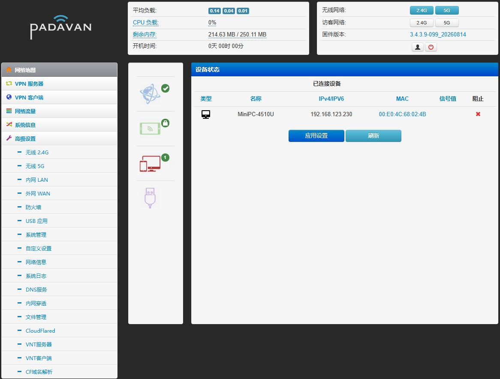

# Padavan-KVR #

##   默认地址            账号密码             wifi名称               wifi密码

##   192.168.2.1         admin/admin          PDCN/PDCN-5G           1234567890

修改自己想要的背景图：刷机之后在`/etc/storage/`新建`bg`文件夹 ，里面放一个`wood.jpg`照片就行。 **`/etc/storage/bg/wood.jpg`**

[修改自己想要的LOGO](/trunk/user/www/n56u_ribbon_fixed/bootstrap/img/asus_logo.png) 替换asus_logo.png文件就行(像素尺寸要求150×70）

[修改默认管理地址wifi名称账号密码](trunk/user/shared/defaults.h) 

默认/tmp分区改为100M[修改/tmp分区大小size_tmp="100M"](trunk/user/scripts/dev_init.sh)

修改/etc/storage分区大小
[1.CONFIG_MTD_STORE_PART_SIZ=0x200000](trunk/configs/boards/NEWIFI3/kernel-3.4.x.config) ，
[2.size_etc="6M"](trunk/user/scripts/dev_init.sh) ，
[3.mtd_part_size=65536](trunk/user/scripts/mtd_storage.sh) ，
storage大小修改方法：首先确认你闪存多大，比如NEWIFI3 d2是32M闪存，再确认你编译后的固件大小，若是插件集成的多，编译后固件大小假如有28M了？那不必修改了，就剩4M了还改啥，假如你是精简的或者只集成了几个小插件，编译后固件大小比如有18M？那就32-18=14M可用，在[十进制转十六进制](https://www.sojson.com/hexconvert/10to16.html)中输入14M的十进制14680064（计算方式14M×1024×1024=14680064） ，转换得出十六进制为e00000 ，在[trunk/configs/boards/NEWIFI3/kernel-3.4.x.config](trunk/configs/boards/NEWIFI3/kernel-3.4.x.config)找到CONFIG_MTD_STORE_PART_SIZ=0x200000改为CONFIG_MTD_STORE_PART_SIZ=0xe00000 ，然后在[trunk/user/scripts/dev_init.sh](trunk/user/scripts/dev_init.sh)找到size_etc="6M"改为size_etc="14M" 最后在[trunk/user/scripts/mtd_storage.sh](trunk/user/scripts/mtd_storage.sh)找到mtd_part_size=65536 改为mtd_part_size=14680064 即可，切记storage分区大小加上编译后的固件大小必须小于路由器闪存大小，不能超过！这样你的storage就能放下更多文件了。

### UI预览 ###

基于hanwckf,chongshengB以及padavanonly的源码整合而来，支持7603/7615/7915的kvr  
编译方法同其他Padavan源码，主要特点如下：  
1.采用padavanonly源码的5.0.4.0无线驱动，支持kvr  
2.添加了chongshengB源码的所有插件  
3.其他部分等同于hanwckf的源码，有少量优化来自immortalwrt的padavan源码  
4.添加了MSG1500的7615版本config  
  
以下附上他们四位的源码地址供参考  
https://github.com/hanwckf/rt-n56u  
https://github.com/chongshengB/rt-n56u  
https://github.com/padavanonly/rt-n56u  
https://github.com/immortalwrt/padavan

**最近的更新代码都来自于hanwckf和MelsReallyBa大佬的4.4内核代码**
- https://github.com/hanwckf/padavan-4.4
- https://github.com/MeIsReallyBa/padavan-4.4
